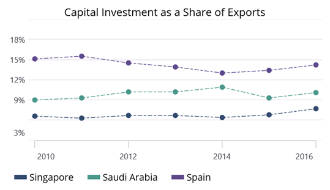

# Legend in .NET MAUI Chart (SfCartesianChart)

The [Legend](https://help.syncfusion.com/cr/maui/Syncfusion.Maui.Charts.ChartBase.html#Syncfusion_Maui_Charts_ChartBase_Legend) provides a list of cartesian series/data points, helping to identify the corresponding data series in the chart. Here's a detailed guide on how to define and customize the legend in the cartesian chart.

## Defining the legend
To define the legend in the chart, initialize the [ChartLegend](https://help.syncfusion.com/cr/maui/Syncfusion.Maui.Charts.ChartLegend.html) class and assign it to the [Legend](https://help.syncfusion.com/cr/maui/Syncfusion.Maui.Charts.ChartBase.html#Syncfusion_Maui_Charts_ChartBase_Legend) property.





<chart:SfCartesianChart>
    <chart:SfCartesianChart.Legend>
        <chart:ChartLegend/>
    </chart:SfCartesianChart.Legend>
</chart:SfCartesianChart>





SfCartesianChart chart = new SfCartesianChart();
chart.Legend = new ChartLegend();





## Legend visibility
The visibility of the chart legend can be controlled using the [IsVisible](https://help.syncfusion.com/cr/maui/Syncfusion.Maui.Charts.ChartLegend.html#Syncfusion_Maui_Charts_ChartLegend_IsVisible) property. By default, the IsVisible property is set to `true`.




    
<chart:SfCartesianChart>
    <chart:SfCartesianChart.Legend>
        <chart:ChartLegend IsVisible = "True"/>
    </chart:SfCartesianChart.Legend>
</chart:SfCartesianChart>





SfCartesianChart chart = new SfCartesianChart();

chart.Legend = new ChartLegend()
{ 
    IsVisible = true 
};





## Legend item visibility
The visibility of individual legend items for specific series can be controlled using the [IsVisibleOnLegend](https://help.syncfusion.com/cr/maui/Syncfusion.Maui.Charts.ChartSeries.html#Syncfusion_Maui_Charts_ChartSeries_IsVisibleOnLegend) property of the series. The default value for IsVisibleOnLegend is `true`.




    
<chart:SfCartesianChart>
    <chart:SfCartesianChart.Legend>
        <chart:ChartLegend/>
    </chart:SfCartesianChart.Legend>

    <chart:LineSeries ItemsSource="{Binding Data}"
                      XBindingPath="XValue"
                      IsVisibleOnLegend="True"
                      YBindingPath="YValue"/>
</chart:SfCartesianChart>





SfCartesianChart chart = new SfCartesianChart();
chart.Legend = new ChartLegend();
LineSeries series = new LineSeries()
{
    ItemsSource = viewModel.Data,
    XBindingPath = "XValue",
    IsVisibleOnLegend = true,
    YBindingPath = "YValue",
};

chart.Series.Add(series);
this.Content=chart;





## Legend icon
To specify the legend icon based on the associated series type, use the [LegendIcon](https://help.syncfusion.com/cr/maui/Syncfusion.Maui.Charts.ChartSeries.html#Syncfusion_Maui_Charts_ChartSeries_LegendIcon) property and change its type using the [ChartLegendIconType](https://help.syncfusion.com/cr/maui/Syncfusion.Maui.Charts.ChartLegendIconType.html) enum values. The default value of the LegendIcon property is `Circle`.





<chart:SfCartesianChart>
    <chart:SfCartesianChart.Legend>
       <chart:ChartLegend/>
    </chart:SfCartesianChart.Legend>

    <chart:ColumnSeries ItemsSource="{Binding Data}"
                        XBindingPath="XValue"
                        YBindingPath="YValue"
                        LegendIcon = "Diamond"/>
</chart:SfCartesianChart>





SfCartesianChart chart = new SfCartesianChart();
chart.Legend = new ChartLegend();
ViewModel viewModel = new ViewModel();

ColumnSeries columnSeries = new ColumnSeries()
{
    ItemsSource = viewModel.Data,
    XBindingPath = "XValue",
    YBindingPath = "YValue",
    LegendIcon = ChartLegendIconType.Diamond,
};

chart.Series.Add(columnSeries);
this.Content=chart;





## Placement
The legend can be positioned to the left, right, top, or bottom of the chart area using the [Placement](https://help.syncfusion.com/cr/maui/Syncfusion.Maui.Charts.ChartLegend.html#Syncfusion_Maui_Charts_ChartLegend_Placement) property in the ChartLegend class. The default placement is `Top`.





<chart:SfCartesianChart>
    <chart:SfCartesianChart.Legend>
        <chart:ChartLegend Placement="Bottom">
        </chart:ChartLegend>
    </chart:SfCartesianChart.Legend>
</chart:SfCartesianChart>





SfCartesianChart chart = new SfCartesianChart();
chart.Legend = new ChartLegend()
{ 
    Placement = LegendPlacement.Bottom 
};





## Toggle the series visibility
The visibility of cartesian series can be controlled by tapping the legend item using the [ToggleSeriesVisibility](https://help.syncfusion.com/cr/maui/Syncfusion.Maui.Charts.ChartLegend.html#Syncfusion_Maui_Charts_ChartLegend_ToggleSeriesVisibility) property. The default value of ToggleSeriesVisibility is `false`.





<chart:SfCartesianChart>
    <chart:SfCartesianChart.Legend>
        <chart:ChartLegend           
          ToggleSeriesVisibility="True">
        </chart:ChartLegend>
    </chart:SfCartesianChart.Legend>
</chart:SfCartesianChart>





SfCartesianChart chart = new SfCartesianChart();
chart.Legend = new ChartLegend()
{ 
    ToggleSeriesVisibility = true 
};





## Legend maximum size request
To set the maximum size request for the legend view, override the [GetMaximumSizeCoefficient](https://help.syncfusion.com/cr/maui/Syncfusion.Maui.Charts.ChartLegend.html#Syncfusion_Maui_Charts_ChartLegend_GetMaximumSizeCoefficient) protected method in [ChartLegend](https://help.syncfusion.com/cr/maui/Syncfusion.Maui.Charts.ChartLegend.html) class. The value should be between 0 and 1, representing the maximum size request, not the desired size for the legend items layout.




    
<chart:SfCartesianChart>
    <chart:SfCartesianChart.Legend>
        <chart:LegendExt/>
    </chart:SfCartesianChart.Legend>
</chart:SfCartesianChart>





public class LegendExt : ChartLegend
{
    protected override double GetMaximumSizeCoefficient()
    {
        return 0.7;
    }
}

SfCartesianChart chart = new SfCartesianChart();
chart.Legend = new LegendExt();





## Items layout
The [ItemsLayout](https://help.syncfusion.com/cr/maui/Syncfusion.Maui.Charts.ChartLegend.html#Syncfusion_Maui_Charts_ChartLegend_ItemsLayout) property is used to customize the arrangement and position of each legend item. The default value is `null`. This property accepts any layout type.





<chart:SfCartesianChart  x:Name="chart1">
    <chart:SfCartesianChart.Legend>
        <chart:ChartLegend Placement="Bottom">
            <chart:ChartLegend.ItemsLayout>
                <FlexLayout HorizontalOptions="Start"
                            Margin="10"
                            WidthRequest="{Binding Width,
                            Source={x:Reference Chart1}}">
                </FlexLayout>
            </chart:ChartLegend.ItemsLayout>
        </chart:ChartLegend>
    </chart:SfCartesianChart.Legend>
</chart:SfCartesianChart>





SfCartesianChart chart = new SfCartesianChart();
. . .
ChartLegend legend = new ChartLegend();
legend.Placement = LegendPlacement.Bottom;

FlexLayout layout = new FlexLayout();
layout.Wrap = FlexWrap.Wrap;
layout.HorizontalOptions = LayoutOptions.Start;
layout.Margin = 10;
layout.SetBinding(WidthRequestProperty, nameof(SfCartesianChart.WidthProperty));
legend.ItemsLayout = layout;

chart.Legend = legend;
this.Content = chart;
        




## Item template
The [ChartLegend](https://help.syncfusion.com/cr/maui/Syncfusion.Maui.Charts.ChartLegend.html) supports customizing the appearance of legend items using the [ItemTemplate](https://help.syncfusion.com/cr/maui/Syncfusion.Maui.Charts.ChartLegend.html#Syncfusion_Maui_Charts_ChartLegend_ItemTemplate) property. The default value of ItemsTemplate is `null`.

N> The BindingContext of the template is the corresponding underlying legend item provided in the ChartLegendItem class.





<chart:SfCartesianChart>
    <chart:SfCartesianChart.Resources>
        <DataTemplate x:Key="legendTemplate">
            <StackLayout Orientation="Horizontal">
                <Rectangle HeightRequest="12" 
                           WidthRequest="12" Margin="3"
                           Background="{Binding IconBrush}"/>
                <Label Text="{Binding Text}" 
                       Margin="3"/>
            </StackLayout>
        </DataTemplate>
    </chart:SfCartesianChart.Resources>  
    
    <chart:SfCartesianChart.Legend>
        <chart:ChartLegend ItemTemplate="{StaticResource legendTemplate}">
        </chart:ChartLegend>
    </chart:SfCartesianChart.Legend>
</chart:SfCartesianChart>





SfCartesianChart chart = new SfCartesianChart();
ChartLegend legend = new ChartLegend();
legend.ItemTemplate = chart.Resources["legendTemplate"] as DataTemplate;
...
chart.Legend = legend;
this.Content = chart;
        




## Limitations
* Do not add items explicitly.
* When using BindableLayouts, do not bind ItemsSource explicitly.
* For better UX, arrange items vertically for left and right dock positions, and vice versa for top and bottom dock positions.
* If the layout's measured size is larger than the MaximumHeightRequest, scrolling will be enabled.
* If MaximumHeightRequest is set to 1 and the chart's available size is smaller than the layout's measured size, the series may not have enough space to draw properly.