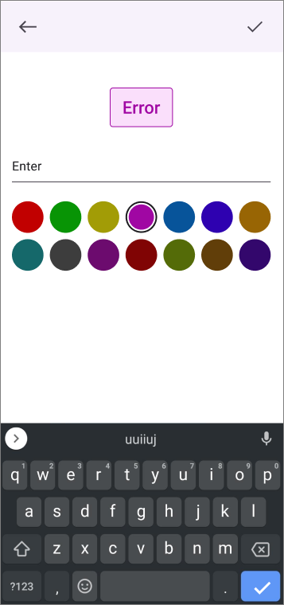

# Stamp Annotations in .NET MAUI PDF Viewer (SfPdfViewer)

The stamp annotations feature of [SfPdfViewer](https://help.syncfusion.com/cr/maui/Syncfusion.Maui.PdfViewer.SfPdfViewer.html) allows you to add, remove and modify stamps or custom images in the PDF document. This section will go through the various types and functions available in PDF Viewer for working with stamp annotations.

## Types of stamps

The following stamp annotation types are now available in the PDF Viewer.

1.	Standard (or built-in) stamps.
2.	Custom (or image) stamps.

## Add stamps to a PDF document

This section will go through how to add stamp annotations to a PDF document programmatically to a PDF document.

### Add standard stamps

There are 18 standard stamp types are available in the `SfPdfViewer` that are most commonly used in documents. The appropriate standard stamp type can be selected from the [StampType](https://help.syncfusion.com/cr/maui/Syncfusion.Maui.PdfViewer.StampType.html) enumeration. 

The following example explains how to create a [Approved](https://help.syncfusion.com/cr/maui/Syncfusion.Maui.PdfViewer.StampType.html#Syncfusion_Maui_PdfViewer_StampType_Approved) standard stamp and add it to the first page of a PDF document using the [AddAnnotation](https://help.syncfusion.com/cr/maui/Syncfusion.Maui.PdfViewer.SfPdfViewer.html#Syncfusion_Maui_PdfViewer_SfPdfViewer_AddAnnotation_Syncfusion_Maui_PdfViewer_Annotation_) method of the `SfPdfViewer`.



StampAnnotation CreateApprovedStandardStamp()
{
    int pageNumber = 1;

    // Define the position to place the stamp.
    PointF position = new PointF(100, 100);

    // Create an approved standard stamp.
    StampAnnotation approvedStamp = new StampAnnotation(StampType.Approved, pageNumber, position);
    
    //return the stamp
    return approvedStamp;
}

void AddStampAnnotation()
{
    StampAnnotation stampAnnotation = CreateApprovedStandardStamp();

    // Add the stamp to the PDF document using `SfPdfViewer` instance.
    PdfViewer.AddAnnotation(stampAnnotation);
}



The following image represents the approved standard stamp appearance in the PDF document.

### Add custom stamps

You can create a custom stamp from any images and add it to a PDF document. The following example explains how to create a custom stamp from an image in the application and add it to a PDF document using the `AddAnnotation` method of the `SfPdfViewer`.



StampAnnotation CreateCustomStamp()
{
    int pageNumber = 1;

    // Define the position and size for the stamp to be placed in the PDF page.
    RectF bounds = new RectF(50, 50, 200, 100);

    // Create image stream from the image to be used as stamp.
    Stream imageStream = this.GetType().Assembly.GetManifestResourceStream("Annotations.Assets." + "Logo.png");

    // Create a custom stamp annotation using the image steeam.
    StampAnnotation customStamp = new StampAnnotation(imageStream,pageNumber,bounds);

    // Return the stamp annotation.
    return customStamp;
}

void AddCustomStampAnnotation()
{
    StampAnnotation stampAnnotation = CreateCustomStamp();

    // Add the stamp to the PDF document using `SfPdfViewer` instance.
    PdfViewer.AddAnnotation(stampAnnotation);
}



### Custom stamp modal view

The (Sfpdfviewer)[(https://help.syncfusion.com/cr/maui/Syncfusion.Maui.PdfViewer.SfPdfViewer.html)] allows receives notifications when creating custom stamps. Notifications are useful for displaying custom dialogs when the custom stamp modal view appears or disappears at the application level.

The `Sfpdfviewer.CustomStampModalViewAppearing` event is triggered whenever the modal view opens for custom stamp. You can cancel the opening of the modal view for the current stamp annotation being edited by setting `e.Cancel = true`, allowing you to display your own custom dialog.




PdfViewer.CustomStampModalViewAppearing += PdfViewer_CustomStampModalViewAppearing;
CustomIcon customIcon;
Annotation editedAnnotation;
……
private void PdfViewer_CustomStampModalViewAppearing(object? sender, AnnotationModalViewAppearingEventArgs e)
{
    e.Cancel = true;
    editedAnnotation = e.Annotation;
    // Implement your own UI for custom stamp annotation and show it.
    ShowCustomDialog();
    customIcon.IsVisible = false;
}

Private void customDialogOkButton_Clicked(object sender, EventArgs e)
{
   //Get the typed opacity value in the custom dialog 
   float newOpacity = customDialog.OpacityValue; 
   if (annotation is StampAnnotation customStamp)
   {
     customStamp.Opacity = newOpacity;
   }
}

 


The `Sfpdfviewer.CustomStampModalViewDisappearing` event is triggered whenever the modal view for stamp annotation is closing.




pdfviewer.CustomStampModalViewDisappearing += PdfViewer_StickyNoteModalViewDisappearing;
….
private void PdfViewer_CustomStampModalViewDisappearing(object? sender, EventArgs e)
{
    // Show your own icons / custom dialog while disappearing the modal view at application level. 
      customIcon.IsVisible = true;
}

 


## Edit the selected stamp

You can edit the properties of the selected stamp annotation programmatically by accessing the selected annotation instance. The selected annotation instance may be obtained from the [AnnotationSelected](https://help.syncfusion.com/cr/maui/Syncfusion.Maui.PdfViewer.SfPdfViewer.html#Syncfusion_Maui_PdfViewer_SfPdfViewer_AnnotationSelected) event. 

The following example shows how to edit some of the properties of the selected stamp annotation. Similarly, you can modify the other properties if required.



/// 

/// Edit the selected stamp annotation.
/// 

/// <param name="selectedAnnotation">The selected annotation instance that may be obtained from the annotation selected event</param>
void EditSelectedStampAnnotation(Annotation selectedAnnotation)
{
    // Type cast the selected annotation as stamp annotation.
    if (selectedAnnotation is StampAnnotation stampAnnotation)
    {
        // Change the opacity to 75%.
        stampAnnotation.Opacity = 0.75f;
    }
}

